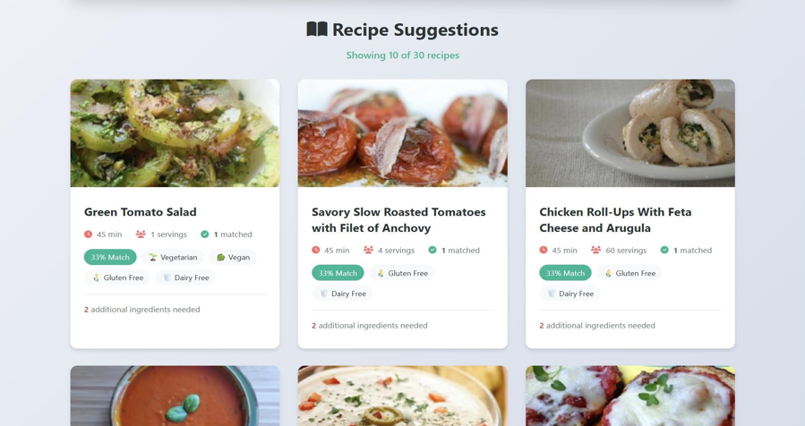

<div align="center">

# 🍳 Interactive Recipe Finder

**Discover delicious recipes using ingredients you already have.**

[](https://developer.mozilla.org/en-US/docs/Web/HTML)
[](https://developer.mozilla.org/en-US/docs/Web/CSS)
[](https://developer.mozilla.org/en-US/docs/Web/JavaScript)
[](https://spoonacular.com/food-api)
[](LICENSE)
[](https://netlify.com)

[Live Demo](#) · [Report Bug](https://github.com/sudeenjain/-interactive-recipe-finder/issues) · [Request Feature](https://github.com/sudeenjain/-interactive-recipe-finder/issues)

</div>

---

## 📖 Overview

**Interactive Recipe Finder** is a production-ready, zero-dependency web application that helps you discover recipes based on ingredients you already have at home. It connects to the Spoonacular API to provide real-time recipe suggestions with smart ingredient matching, filtering by diet and cuisine, and detailed recipe breakdowns — all in a clean, dark-themed UI that works beautifully on every device.

---

## ✨ Features

| Feature | Description |
|---|---|
| 🔍 **Ingredient Search** | Add multiple ingredients and find the best-matching recipes |
| 🎯 **Smart Matching** | See what % of ingredients you already have |
| 🥗 **Diet Filters** | Filter by Vegetarian, Vegan, Keto, Gluten-Free, Paleo, Pescetarian |
| 🌍 **Cuisine Filters** | Italian, Mexican, Indian, Chinese, Japanese, Thai, and more |
| ⏱️ **Time Filter** | Set maximum cook time in minutes |
| 📋 **Recipe Details** | Full ingredient list, step-by-step instructions, health score |
| ♾️ **Load More** | Paginated results — load more recipes without a new API call |
| 📱 **Fully Responsive** | Mobile, tablet, and desktop layouts |
| ⌨️ **Autocomplete** | Smart ingredient suggestions as you type |
| ♿ **Accessible** | ARIA labels, keyboard navigation, focus management |
| 🔒 **Secure** | XSS prevention via HTML escaping, API key in config file |

---

## 🛠️ Tech Stack

| Layer | Technology |
|---|---|
| **Structure** | HTML5 with semantic elements |
| **Styles** | Pure CSS3 — variables, grid, flexbox, animations |
| **Interactivity** | Vanilla JavaScript (ES2020+) |
| **Fonts** | Playfair Display + DM Sans (Google Fonts) |
| **Icons** | Font Awesome 6 |
| **API** | [Spoonacular Food API](https://spoonacular.com/food-api) |
| **Hosting** | Netlify / GitHub Pages / Vercel |

**No npm. No build step. No dependencies.** Just open `index.html`.

---

## 📁 Project Structure

```
interactive-recipe-finder/
├── index.html          # App markup & structure
├── style.css           # All styles (variables, components, responsive)
├── script.js           # App logic, state, API calls
├── config.js           # API key configuration (gitignored in production)
├── .env.example        # Environment variable template
├── .gitignore          # Files to exclude from git
├── README.md           # This file
└── screenshots/
    ├── hero.png
    ├── recipe-cards.png
    └── modal.png
```

---

## 🚀 Quick Start

### 1. Clone the repository

```bash
git clone https://github.com/sudeenjain/-interactive-recipe-finder.git
cd -interactive-recipe-finder
```

### 2. Get a free Spoonacular API key

1. Go to [spoonacular.com/food-api](https://spoonacular.com/food-api)
2. Click **"Get Started"** and create a free account
3. Copy your API key from the dashboard
4. Free tier: **150 requests/day** (1 request per search)

### 3. Add your API key

Open `config.js` and replace the placeholder:

```javascript
const CONFIG = {
    API_KEY: 'YOUR_ACTUAL_API_KEY_HERE',  // ← Paste here
    ...
};
```

### 4. Open the app

```bash
# Option A — just open in browser
open index.html

# Option B — use a local server (recommended to avoid CORS issues)
npx serve .
# or
python3 -m http.server 3000
```

Visit `http://localhost:3000`

---

## ⚙️ Configuration

All app settings live in `config.js`:

```javascript
const CONFIG = {
    API_KEY: 'YOUR_SPOONACULAR_API_KEY',   // Required
    BASE_URL: 'https://api.spoonacular.com/recipes',
    RECIPES_PER_PAGE: 12,                  // Cards shown per load
    MAX_RECIPES_FETCH: 30,                 // Max fetched per search
    ERROR_DISPLAY_MS: 6000,               // Error toast duration (ms)
};
```

### Environment Variables (for CI/CD deployments)

Copy `.env.example` to `.env` and fill in your values:

```bash
cp .env.example .env
```

```env
SPOONACULAR_API_KEY=your_api_key_here
```

---

## 🌐 Deployment

### Netlify (Recommended — Free)

1. Push your code to GitHub
2. Go to [netlify.com](https://netlify.com) → **New site from Git**
3. Connect your repository
4. Set build command: *(leave empty)*
5. Set publish directory: `/`
6. Add environment variable: `SPOONACULAR_API_KEY=your_key`
7. Click **Deploy site**

> ⚠️ For static deployments, inject the API key at build time or use a serverless proxy function.

### GitHub Pages

```bash
git push origin main
```
Then enable Pages in **Settings → Pages → Branch: main**.

### Vercel

```bash
npx vercel --prod
```

---

## 📱 Responsive Design

The app is fully responsive across all breakpoints:

| Breakpoint | Layout |
|---|---|
| `< 700px` (Mobile) | Single column, stacked filters, sheet-style modal |
| `700–900px` (Tablet) | 2-column recipe grid, 2-column filters |
| `> 900px` (Desktop) | 3-column recipe grid, 3-column filters, centered modal |

---

## 🔒 Security

- **XSS Prevention** — All user inputs and API responses are HTML-escaped before rendering
- **API Key Protection** — Keys stored in `config.js` (not committed to version control)
- **No eval()** — Zero use of dangerous JavaScript patterns
- **rel="noopener noreferrer"** — All external links are sandboxed
- **Input validation** — Duplicate and empty inputs are rejected

---

## 🎨 Screenshots

### Hero & Ingredient Input


### Recipe Cards


### Recipe Details Modal


### Search Results


---

## 🐛 Troubleshooting

| Problem | Solution |
|---|---|
| *"Please add your API key"* | Add your Spoonacular key to `config.js` |
| *"Daily quota reached"* | Free tier = 150 req/day. Wait until midnight UTC |
| *"API error 401"* | Key is invalid. Double-check on Spoonacular dashboard |
| *No recipes found* | Try fewer/different ingredients, or remove filters |
| *Images not loading* | Normal if Spoonacular CDN is slow — placeholders shown |
| *Modal won't close* | Press Escape or click the backdrop |

---

## 🔮 Roadmap

- [ ] Save favorite recipes (localStorage)
- [ ] Meal planner with weekly calendar
- [ ] Shopping list generation
- [ ] Nutritional breakdown charts
- [ ] Print-friendly recipe view
- [ ] PWA with offline support
- [ ] User authentication & cloud sync

---

## 🤝 Contributing

1. Fork the repository
2. Create your branch: `git checkout -b feature/my-feature`
3. Commit your changes: `git commit -m 'Add my feature'`
4. Push to the branch: `git push origin feature/my-feature`
5. Open a Pull Request

---

## 📄 License

MIT License — see [LICENSE](LICENSE) for details.

---

## 👨‍💻 Author

**Sudeen Jain H R**

- GitHub: [@sudeenjain](https://github.com/sudeenjain)

---

<div align="center">
  <p>Built with ❤️ to reduce food waste, one recipe at a time.</p>
  <p>
    <a href="https://spoonacular.com/food-api">Spoonacular API</a> ·
    <a href="https://github.com/sudeenjain/-interactive-recipe-finder">GitHub</a>
  </p>
</div>
