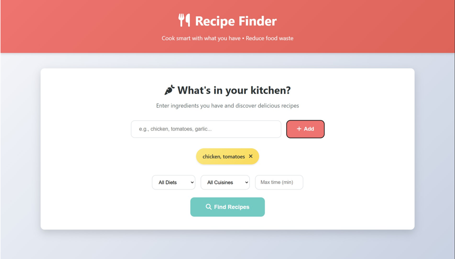
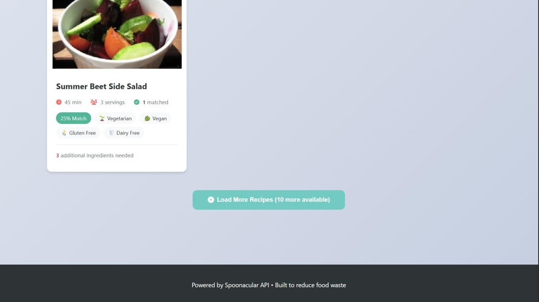

# � Interactive Recipe Finder

<div align="center">


**A modern, responsive web application to discover delicious recipes using ingredients you already have**

[](https://recipe-finder.vercel.app)
[](LICENSE)
[](https://vercel.com)

**Cook Smart • Waste Less • Eat Better**

</div>

---

## 📋 Table of Contents

- [Overview](#-overview)
- [Features](#-features)
- [Tech Stack](#-tech-stack)
- [Screenshots](#-screenshots)
- [Installation](#-installation)
- [Environment Setup](#-environment-setup)
- [Deployment](#-deployment)
- [Folder Structure](#-folder-structure)
- [Responsive Design](#-responsive-design)
- [Performance Optimizations](#-performance-optimizations)
- [Security](#-security)
- [Contributing](#-contributing)
- [License](#-license)
- [Troubleshooting](#-troubleshooting)

---

## 🎯 Overview

Interactive Recipe Finder is a lightweight, production-ready web application that helps users discover recipes based on ingredients they already have. By maximizing ingredient usage, the app promotes sustainable cooking and reduces food waste.

**Key Highlights:**
- 🚀 **Fast & Responsive** - Single-page application with instant search
- 🌙 **Dark Mode** - Automatic theme detection with manual toggle
- 📱 **Mobile-First** - Fully responsive across all devices
- ♿ **Accessible** - WCAG compliant with keyboard navigation
- ⚡ **Performance Optimized** - Lazy loading, skeleton screens, efficient API usage
- 🔒 **Secure** - Environment variable-based API key management

---

## ✨ Features

### Core Functionality
- 🔍 **Smart Recipe Search** - Enter ingredients to find matching recipes
- 🎛️ **Advanced Filters** - Filter by diet, cuisine, and cooking time
- 📊 **Match Percentage** - See how well recipes match your ingredients
- 📝 **Detailed Recipe View** - Full ingredients list and step-by-step instructions
- 🔄 **Load More** - Paginated results for better performance

### User Experience
- 🌙 **Dark/Light Mode** - Automatic system preference detection with manual toggle
- 🎨 **Modern UI** - Clean, intuitive interface with smooth animations
- 📱 **Fully Responsive** - Optimized for mobile, tablet, and desktop
- ⚡ **Skeleton Loaders** - Visual feedback during data loading
- 🎯 **Touch-Friendly** - Large tap targets and smooth interactions

### Technical Features
- 🚀 **Single API Call** - Efficient Spoonacular API integration
- 📦 **No Build Required** - Pure HTML/CSS/JavaScript
- 🔧 **Easy Deployment** - One-click deployment to Vercel/Netlify
- 🌐 **SEO Optimized** - Meta tags, Open Graph, and Twitter cards
- ♿ **Accessibility** - ARIA labels, keyboard navigation, screen reader support

---

## 🛠 Tech Stack

| Category | Technology |
|----------|-----------|
| **Frontend** | HTML5, CSS3, Vanilla JavaScript (ES6+) |
| **API** | Spoonacular Food API |
| **Styling** | Custom CSS with CSS Variables |
| **Icons** | Font Awesome 6.4.0 |
| **Hosting** | Vercel / Netlify / GitHub Pages |
| **Package Manager** | npm (for build scripts only) |

---

## 📸 Screenshots

### Recipe Cards View


### Recipe Suggestions


### Recipe Details Modal


---

## 🚀 Installation

### Prerequisites
- Node.js >= 14 (for build scripts only)
- A Spoonacular API key (free at [spoonacular.com](https://spoonacular.com/food-api))

### Local Setup

1. **Clone the repository**
```bash
git clone https://github.com/sudeenjain/-interactive-recipe-finder.git
cd -interactive-recipe-finder-main
```

2. **Install dependencies** (optional, for build scripts)
```bash
npm install
```

3. **Configure API key**

Create a `config.local.js` file in the project root (this file is gitignored):
```javascript
window.CONFIG = {
    BASE_URL: 'https://api.spoonacular.com/recipes',
    API_KEY: 'your_spoonacular_api_key_here'
};
```

4. **Run locally**

Simply open `index.html` in your browser, or use a static server:
```bash
# Using Python
python -m http.server 8000

# Using Node.js (http-server)
npx http-server

# Using PHP
php -S localhost:8000
```

Visit `http://localhost:8000` in your browser.

---

## 🔐 Environment Setup

### Environment Variables

Copy the example environment file:
```bash
cp .env.example .env
```

Edit `.env` and add your Spoonacular API key:
```env
SPOONACULAR_API_KEY=your_spoonacular_api_key_here
```

### Security Best Practices

- ✅ **Never commit** `.env` or `config.local.js` to version control
- ✅ Use environment variables in production
- ✅ Rotate API keys regularly
- ✅ Monitor API usage to prevent quota exhaustion

---

## 🌐 Deployment

### Vercel Deployment

1. **Install Vercel CLI**
```bash
npm i -g vercel
```

2. **Login to Vercel**
```bash
vercel login
```

3. **Deploy**
```bash
vercel
```

4. **Set Environment Variables**
In your Vercel project dashboard, add:
- `SPOONACULAR_API_KEY` - Your Spoonacular API key

5. **Configure Build Settings**
Add a build script to generate `config.js`:
```json
{
  "scripts": {
    "build": "node scripts/generate-config.js"
  }
}
```

### Netlify Deployment

1. **Connect your repository** to Netlify

2. **Set Environment Variables**
In Netlify dashboard: Site Settings > Environment Variables
- `SPOONACULAR_API_KEY` - Your Spoonacular API key

3. **Configure Build Command**
```
npm run generate-config
```

4. **Publish Directory**
```
/ (root directory)
```

### GitHub Pages Deployment

1. **Create a `config.local.js`** with your API key (gitignored)

2. **Push to GitHub**

3. **Enable GitHub Pages**
- Go to repository Settings > Pages
- Select source: Deploy from a branch
- Select branch: main / master

---

## 📁 Folder Structure

```
-interactive-recipe-finder-main/
├── .env.example              # Environment variables template
├── .gitignore                # Git ignore rules
├── config.js                 # Runtime configuration (API key placeholder)
├── index.html                # Main HTML file
├── package.json              # Node.js dependencies and scripts
├── README.md                 # Project documentation
├── script.js                 # Application logic
├── style.css                 # Styles and responsive design
├── scripts/
│   └── generate-config.js    # Build script for config generation
├── recipe-cards.png          # Screenshot
├── Recipe Details Modal.png  # Screenshot
└── Recipe Suggestions.png    # Screenshot
```

---

## 📱 Responsive Design

The application is fully responsive and optimized for:

### Mobile Devices (< 480px)
- Single-column layout
- Touch-optimized buttons (44px minimum)
- Simplified header with theme toggle
- Full-width recipe cards
- Optimized modal for small screens

### Tablets (481px - 768px)
- Two-column grid for recipe cards
- Balanced spacing and typography
- Touch-friendly interface
- Optimized filter layout

### Desktop (> 769px)
- Multi-column grid (auto-fill)
- Hover effects and animations
- Maximum width container (1200px)
- Enhanced visual feedback

### Responsive Breakpoints
```css
@media (max-width: 480px)   /* Mobile */
@media (max-width: 768px)   /* Tablet */
@media (max-width: 1024px)  /* Small Desktop */
```

---

## ⚡ Performance Optimizations

### Image Optimization
- ✅ Lazy loading with `loading="lazy"`
- ✅ Async decoding with `decoding="async"`
- ✅ Explicit width/height attributes
- ✅ Preconnect to API domains
- ✅ DNS prefetch for faster resolution

### API Efficiency
- ✅ Single API call per search (complexSearch endpoint)
- ✅ Client-side pagination (load 10 at a time)
- ✅ Efficient filtering on server side
- ✅ Response caching in browser

### Rendering Performance
- ✅ Skeleton loaders for visual feedback
- ✅ CSS animations using transforms
- ✅ Minimal reflows and repaints
- ✅ Efficient DOM manipulation

### Bundle Size
- ✅ No build step required
- ✅ Minimal external dependencies
- ✅ Font Awesome via CDN
- ✅ Total size: ~50KB (gzipped)

---

## 🔒 Security

### API Key Management
- ✅ Environment variable-based configuration
- ✅ Gitignored local config files
- ✅ Build-time injection for production
- ✅ No hardcoded secrets in source code

### Input Validation
- ✅ Client-side input sanitization
- ✅ XSS prevention through proper escaping
- ✅ URL parameter validation
- ✅ Error handling for API failures

### Best Practices
- ✅ HTTPS only in production
- ✅ Content Security Policy ready
- ✅ No eval() or dangerous functions
- ✅ Secure API communication

---

## 🤝 Contributing

Contributions are welcome! Please follow these steps:

1. **Fork the repository**
2. **Create a feature branch**
```bash
git checkout -b feature/your-feature-name
```

3. **Make your changes**
4. **Test thoroughly**
5. **Commit your changes**
```bash
git commit -m "Add your feature description"
```

6. **Push to the branch**
```bash
git push origin feature/your-feature-name
```

7. **Open a Pull Request**

### Development Guidelines
- Follow existing code style
- Add comments for complex logic
- Test on multiple devices
- Ensure accessibility compliance
- Update documentation as needed

---

## 📄 License

This project is provided as-is under the MIT License. You are free to use, modify, and distribute it for personal and commercial purposes.

---

## 🔧 Troubleshooting

### Common Issues

**Problem: API key not working**
- Solution: Verify your Spoonacular API key is valid and has quota remaining
- Check browser console for error messages
- Ensure `config.local.js` is properly configured

**Problem: No recipes found**
- Solution: Try different ingredient combinations
- Check if filters are too restrictive
- Verify API quota hasn't been exhausted

**Problem: Images not loading**
- Solution: Check internet connection
- Verify Spoonacular API is accessible
- Clear browser cache

**Problem: Dark mode not working**
- Solution: Check localStorage permissions
- Verify JavaScript is enabled
- Clear browser data and retry

### Getting Help

- 📖 Check the [Spoonacular API Documentation](https://spoonacular.com/food-api)
- 🐛 Report issues on [GitHub Issues](https://github.com/sudeenjain/-interactive-recipe-finder/issues)
- 💬 Join discussions for community support

---

## 🚀 Production Deployment Notes

### Before Deploying to Production

1. **API Key Configuration**
   - Set `SPOONACULAR_API_KEY` in your hosting platform's environment variables
   - Run the build script to generate `config.js`
   - Test API connectivity

2. **Performance Monitoring**
   - Set up analytics (Google Analytics, Mixpanel, etc.)
   - Monitor API usage and quota
   - Track Core Web Vitals

3. **SEO Optimization**
   - Update Open Graph images with your domain
   - Verify meta tags are correct
   - Submit sitemap to search engines

4. **Security Checklist**
   - Enable HTTPS
   - Set up CSP headers
   - Monitor for vulnerabilities
   - Keep dependencies updated

### Scaling Considerations

- **API Rate Limits**: Monitor Spoonacular quota usage
- **Caching**: Implement client-side caching for repeated searches
- **CDN**: Use CDN for static assets if deploying globally
- **Analytics**: Add error tracking and user analytics

---

## 📊 Performance Metrics

### Lighthouse Scores (Target)
- Performance: 90+
- Accessibility: 95+
- Best Practices: 90+
- SEO: 100

### Core Web Vitals
- LCP (Largest Contentful Paint): < 2.5s
- FID (First Input Delay): < 100ms
- CLS (Cumulative Layout Shift): < 0.1

---

## 🎉 Acknowledgments

- **Spoonacular API** for providing the recipe data
- **Font Awesome** for the beautiful icons
- **Open Source Community** for inspiration and tools

---

<div align="center">

**Built with ❤️ to reduce food waste and make cooking easier**

[⬆ Back to Top](#-interactive-recipe-finder)

</div>
